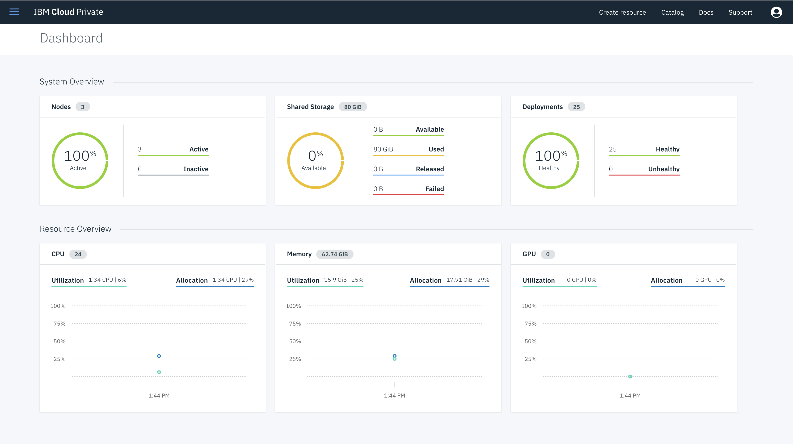
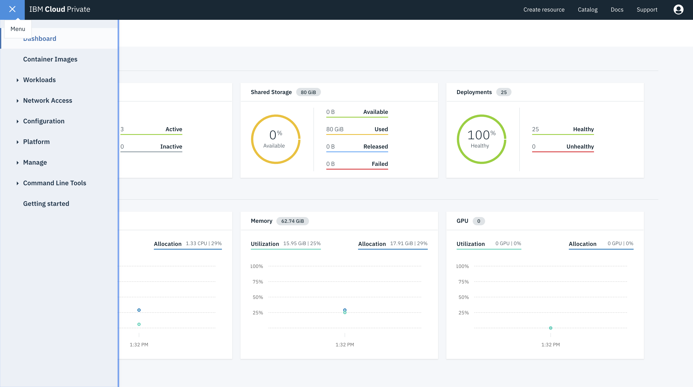
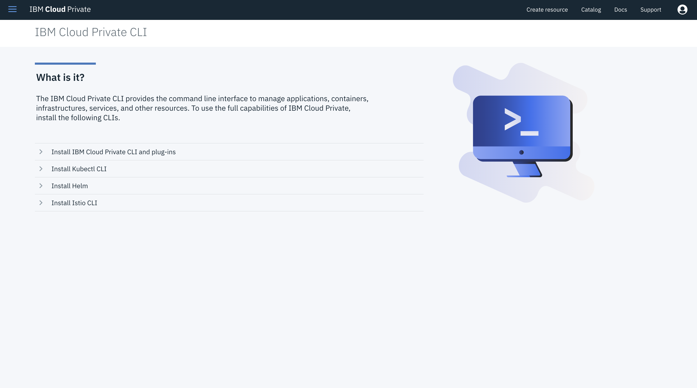

// INSTRUCTION: Please remove all comments that start INSTRUCTION prior to commit. Most comments should be removed, although not the copyright.
// INSTRUCTION: The copyright statement must appear at the top of the file
//
// Copyright (c) 2018 IBM Corporation and others.
// Licensed under Creative Commons Attribution-NoDerivatives
// 4.0 International (CC BY-ND 4.0)
//   https://creativecommons.org/licenses/by-nd/4.0/
//
// Contributors:
//     IBM Corporation
//
:projectid: icp-intro
:page-layout: guide
:page-duration: 25 minutes
:page-releasedate: 2018-10-05
:page-description: Explore how to deploy microservices to IBM Cloud Private and manage your cluster.
:page-tags: ['microservices', 'Kubernetes', 'Docker', 'containers', 'kubectl', 'ICP', 'IBM Cloud Private']
:page-permalink: /guides/{projectid}
:page-related-guides: ['kubernetes-intro']
:common-includes: https://raw.githubusercontent.com/OpenLiberty/guides-common/master
:source-highlighter: prettify
:page-seo-title: IBM Cloud Private tutorial
:page-seo-description: How to deploy microservices to IBM Cloud Private and manage your cluster
= Deploying microservices to IBM Cloud Private

[.hidden]
NOTE: This repository contains the guide documentation source. To view the guide in published form, view it on the https://openliberty.io/guides/{projectid}.html[Open Liberty website].

Deploy microservices in Open Liberty Docker containers to IBM Cloud Private and manage them with the Kubernetes CLI, kubectl.

:minikube-ip: 192.168.99.100
:kube: Kubernetes
:hashtag: #
:win: WINDOWS
:mac: MAC
:linux: LINUX
:name-api: http://[hostname]:31000/api/name
:ping-api: http://[hostname]:32000/api/ping


// =================================================================================================
// What is {kube}
// =================================================================================================

== What is IBM Cloud Private (ICP)?

IBM Cloud Private is a {kube} platform that provides an on-premises cloud solution. It has many useful features for your cloud needs. The main feature it provides is a {kube} cluster. It works just like any {kube} cluster and can be manipulated with `kubectl`. Another useful feature it provides is a private docker registry so that you don't need to use something like https://hub.docker.com/[Docker Hub]. Some other capabilities it provides include a dashboard and a web interface to deploy helm charts.

// =================================================================================================
// Introduction
// =================================================================================================

== What you'll learn

You will learn how to deploy two microservices in Open Liberty containers to an ICP cluster.
You'll then manage your deployed microservices using the `kubectl` command-line
interface for {kube}. The `kubectl` CLI is your primary tool for communicating with and managing your
{kube} cluster.

The two microservices you'll deploy are called `name` and `ping`. The `name` microservice
displays a brief greeting and the name of the
container it's running in. This message makes it easy to differentiate it from its other replicas. The `ping` microservice
pings the {kube} Service that encapsulates the `name` pods. This communication demonstrates
how communication can be established between pods inside a cluster.

// =================================================================================================
// Prerequisites
// =================================================================================================

== Prerequisites

First, you will need a containerization software for building containers. {kube} supports various types. You will use `Docker` in this guide. For installation instructions, refer to the https://docs.docker.com/install/[official Docker documentation].

You will also need to install the https://kubernetes.io/docs/tasks/tools/install-kubectl/[kubectl] cli tool.

Finally, you'll need to have access to an IBM Cloud Private instance that you may use to follow the guide.

// =================================================================================================
// Getting Started
// =================================================================================================

include::{common-includes}/gitclone.adoc[]

// no "try what you'll build" section in this guide since it would be too long due to all setup the user will have to do.


// =================================================================================================
// Connecting to your ICP cluster
// =================================================================================================

== Connecting to your ICP cluster

First, login and navigate to your ICP dashboard.



Click the icon located at the upper left of the page to expand the menu.



Click `Command Line Tools > Cloud Private CLI` to navigate to the `IBM Cloud Private CLI` page.

image::images/cli-tools-expanded.png[]

Click `Install IBM Cloud Private CLI and plug-ins` and follow the instructions to download the `cloudctl` tool.



****
[system]#*{linux} | {mac}*#

Move and rename the downloaded file to `/usr/local/bin/cloudctl` then make it executable.

```
sudo mv `ls cloudctl-*` /usr/local/bin/cloudctl
sudo chmod +x /usr/local/bin/cloudctl
```

[system]#*{win}*#

Create a directory called `cloudctl-bin` under your user directory and add it to your `PATH` environment variable.

```
mkdir %systemdrive%%userprofile%\cloudctl-bin
set PATH=%PATH%;%systemdrive%%userprofile%\cloudctl-bin
```

Next, move the file you downloaded into the `cloudctl-bin` directory and rename the file to `cloudctl.exe`.
****

Connect the `kubectl` cli tool to your cluster by logging in to the cluster, replace `[hostname]` and `[port]` as appropriate with the values for your ICP instance.

```
cloudctl login -a https://[hostname]:[port]  --skip-ssl-validation
```

When prompted, enter your username and password. Then, select the cluster account. Finally, ensure to select the `default` namespace.

----
Username> enter_your_username	

Password> enter_your_password
Authenticating...
OK

Select an account:
1. mycluster Account (id-mycluster-account)
Enter a number> 1
Targeted account mycluster Account (id-mycluster-account)

Select a namespace:
1. cert-manager
2. default
3. ibmcom
4. istio-system
5. kube-public
6. kube-system
7. platform
8. services
Enter a number> 2
Targeted namespace default

Configuring kubectl ...
Property "clusters.mycluster" unset.
Property "users.mycluster-user" unset.
Property "contexts.mycluster-context" unset.
Cluster "mycluster" set.
User "mycluster-user" set.
Context "mycluster-context" created.
Switched to context "mycluster-context".
OK

Configuring helm: ~/.helm
OK
----

Verify that you're connected to the cluster by checking the cluster's nodes.

```
kubectl get nodes
```

----
NAME           STATUS    ROLES                          AGE       VERSION
192.168.0.15   Ready     worker                         10d       v1.11.1+icp-ee
192.168.0.10   Ready     worker                         10d       v1.11.1+icp-ee
192.168.0.5    Ready     etcd,management,master,proxy   10d       v1.11.1+icp-ee
----

// =================================================================================================
// Building and containerizing the microservices
// =================================================================================================

== Building and containerizing the microservices

The first step of deploying to {kube} is to build your microservices and containerize them with Docker.

The starting Java project, which you can find in the `start` directory, is a multi-module Maven
project. It's made up of the `name` and `ping` microservices. Each microservice resides in its own directory,
`start/name` and `start/ping`. Each of these directories also contains a Dockerfile, which is necessary
for building Docker images. If you're unfamiliar with Dockerfiles, check out the
https://openliberty.io/guides/docker.html[Using Docker containers to develop microservices] guide,
which covers Dockerfiles in depth.

If you're familiar with Maven and Docker, you might be tempted to run a Maven build first and then
use the `.war` file to build a Docker image. While it's by no means a wrong
approach, we've setup the projects such that this process is automated
as a part of a single Maven build. It's created by using the `dockerfile-maven` plug-in. The plugin automatically
picks up the Dockerfile located in the same directory as its POM file and builds a Docker image from it.
If you're using Docker for Windows ensure that, on the Docker for Windows _General Setting_ page, the option is set to `Expose daemon on tcp://localhost:2375 without TLS`. This configuration is required by the `dockerfile-maven` part of the build.

Navigate to the `start` directory and run the following command:

```
mvn package
```

The `package` goal automatically starts the `dockerfile-maven:build` goal. It runs during the
`package` phase. This goal builds a Docker image from the Dockerfile located in the same directory
as the POM file.

During the build, you'll see various Docker messages describing what images are being downloaded and
built. When the build finishes, run the following command to list all local Docker images:

```
docker images
```

Verify that the `name:1.0-SNAPSHOT` and `ping:1.0-SNAPSHOT` images are listed among them, for example:

[source, role="no_copy"]
----
REPOSITORY                                                       TAG
ping                                                             1.0-SNAPSHOT
name                                                             1.0-SNAPSHOT
----

If you don't see the `name:1.0-SNAPSHOT` and `ping:1.0-SNAPSHOT` images, then check the Maven
build log for any potential errors.

// =================================================================================================
// Pushing the images to a private docker registry
// =================================================================================================

== Pushing the images to a private docker registry

Pushing the images a private registry will allow the ICP cluster to create pods using your docker images. Since it's a private registry, only users with access to your cluster will have access to access these images.

First, you will add your ICP instance to an insecure registry whitelist in your docker preferences. Go to your Docker Preferences and select the `Daemon` tab. If it's not checked, then check the `Experimental Features` box. Next, add an insecure registry to the list in the form `[hostname]:8500` where hostname is the hostname of your ICP instance. Click the `Apply & Restart` button and wait for the docker engine to start again.

Then, login to the docker registry from your command line and enter your user name and password when prompted.

```
docker login [hostname]:8500
```

[source, role="no_copy"]
----
Username: your_username
Password: your_password
WARNING! Your password will be stored unencrypted in ~/.docker/config.json.
Configure a credential helper to remove this warning. See
https://docs.docker.com/engine/reference/commandline/login/#credentials-store

Login Succeeded
----

Next, you need to tag your docker image with the relevant data about your registry.

```
docker tag name:1.0-SNAPSHOT [hostname]:8500/default/name:1.0-SNAPSHOT
docker tag ping:1.0-SNAPSHOT [hostname]:8500/default/ping:1.0-SNAPSHOT
```

Then, push your images to the private registry.

```
docker push [hostname]:8500/default/name:1.0-SNAPSHOT
docker push [hostname]:8500/default/ping:1.0-SNAPSHOT
```

// =================================================================================================
// Deploying the microservices
// =================================================================================================

== Deploying the microservices

Now that your Docker images are built, deploy them using a Kubernetes resource definition.

A Kubernetes resource definition is a yaml file that contains a description of all your deployments, services, or any other resources that you want to deploy. All resources can also be deleted from the cluster by using the same yaml file that you used to deploy them.

To deploy the `name` and `ping` applications, first create the `kubernetes.yaml` file in the `start` directory:

[source, yaml]
----
include::finish/kubernetes.yaml[tags=**;]
----

This file defines four {kube} resources. It defines two deployments and two services. A {kube} deployment is a resource responsible for controlling the creation and management of pods. The file specifies to use the images stored in the ICP instance's private registry. You may specify it by prefixing the `name:1.0-SNAPSHOT` image name with `mycluster.icp:8500/default`. `mycluster.icp:8500` refers to the current ICP instance's docker registry, and `default` refers to the `default` namespace.

Run the following commands to deploy the resources as defined in kubernetes.yaml:

```
kubectl apply -f kubernetes.yaml
```

When the apps are deployed, run the following command to check the status of your pods:

```
kubectl get pods
```

If all the pods are healthy and running, then you'll see an output similar to the following:

[source, role="no_copy"]
----
NAME                               READY     STATUS    RESTARTS   AGE
name-deployment-6bd97d9bf6-4ccds   1/1       Running   0          15s
ping-deployment-645767664f-nbtd9   1/1       Running   0          15s
----

Next, you will make requests to your services.

Then, `curl` or visit the following URLs to access your microservices, substituting the appropriate hostname:

- {name-api}
- {ping-api}/name-service

The first URL returns a brief greeting followed by the name of the pod that the `name` microservice
runs in. The second URL returns `pong` if it received a good response from the `name-service`
{kube} Service. Visiting `{ping-api}/[kube-service]` in general returns either
a good or a bad response depending on whether `kube-service` is a valid {kube} Service that can be accessed.

// =================================================================================================
// Scaling a deployment
// ================================================================================================

== Scaling a deployment

To use load balancing, you need to scale your deployments. When you scale a deployment, you replicate its pods, creating more running instances of your applications. Scaling is one of the primary advantages of {kube} because replicating your application allows it to accommodate more traffic. Then descale your deployments to free up resources when the traffic decreases.

As an example, scale the `name` Deployment to 3 pods by running the following command:

```
kubectl scale deployment/name-deployment --replicas=3
```

Use the following command to verify that two new pods have been created.

```
kubectl get pods
```

[source, role="no_copy"]
----
NAME                               READY     STATUS    RESTARTS   AGE
name-deployment-6bd97d9bf6-4ccds   1/1       Running   0          1m
name-deployment-6bd97d9bf6-jf9rs   1/1       Running   0          25s
name-deployment-6bd97d9bf6-x4zth   1/1       Running   0          25s
ping-deployment-645767664f-nbtd9   1/1       Running   0          1m
----

Wait for your two new pods to be in the ready state, then `curl` or visit the `{name-api}` URL. You'll notice that the service will respond with a different name when you call it multiple times. This is because there are now three pods running all serving the `name` application. Similarly, to descale your deployments you can use the same scale command with fewer replicas.

// =================================================================================================
// Testing microservices that are running on {kube}
// =================================================================================================

== Testing microservices that are running on ICP

A few tests are included for you to test the basic functionality of the microservices. If a test failure
occurs, then you might have introduced a bug into the code. To run the tests, wait for all pods to be
in the ready state before proceeding further. The default properties defined in the `pom.xml` are:

[cols="15, 100", options="header"]
|===
| *Property*        | *Description*
| cluster.ip        | IP or hostname for your cluster
| name.kube.service | Name of the {kube} Service wrapping the `name` pods, `name-service` by default.
| name.node.port    | The NodePort of the {kube} Service `name-service`, 31000 by default.
| ping.node.port    | The NodePort of the {kube} Service `ping-service`, 32000 by default.
|===

Navigate back to the `start` directory.

Run the integration tests against a cluster running with a host name of `localhost`:

```
mvn verify -Ddockerfile.skip=true -Dcluster.ip=[hostname]
```

The `dockerfile.skip` parameter is set to `true` in order to skip building a new Docker image.

If the tests pass, you'll see an output similar to the following for each service respectively:

[source, role="no_copy"]
----
-------------------------------------------------------
 T E S T S
-------------------------------------------------------
Running it.io.openliberty.guides.name.NameEndpointTest
Tests run: 1, Failures: 0, Errors: 0, Skipped: 0, Time elapsed: 0.673 sec - in it.io.openliberty.guides.name.NameEndpointTest

Results :

Tests run: 1, Failures: 0, Errors: 0, Skipped: 0
----

[source, role="no_copy"]
----
-------------------------------------------------------
 T E S T S
-------------------------------------------------------
Running it.io.openliberty.guides.ping.PingEndpointTest
Tests run: 2, Failures: 0, Errors: 0, Skipped: 0, Time elapsed: 2.222 sec - in it.io.openliberty.guides.ping.PingEndpointTest

Results :

Tests run: 2, Failures: 0, Errors: 0, Skipped: 0
----


// =================================================================================================
// Tear Down
// =================================================================================================

== Tearing down the environment

When you no longer need your deployed microservices, you can delete all {kube} resources by running the `kubectl delete` command:

```
kubectl delete -f kubernetes.yaml
```

Logout of your docker registry.

```
docker logout [hostname]:8500
```

Logout of your ICP cluster.

```
cloudctl logout
```

// =================================================================================================
// finish
// =================================================================================================

== Great work! You're done!

You have just deployed two microservices to ICP. You then scaled a microservice and ran integration tests against miroservices that are running in an ICP 
cluster.

// Include the below from the guides-common repo to tell users how they can contribute to the guide
include::{common-includes}/finish.adoc[]

// DO NO CREATE ANYMORE SECTIONS AT THIS POINT
// Related guides will be added in automatically here if you included them in ":page-related-guides"
